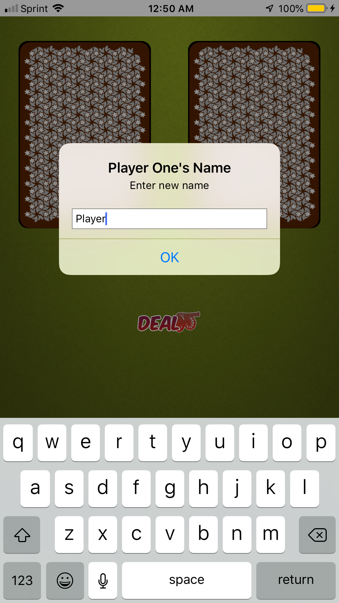
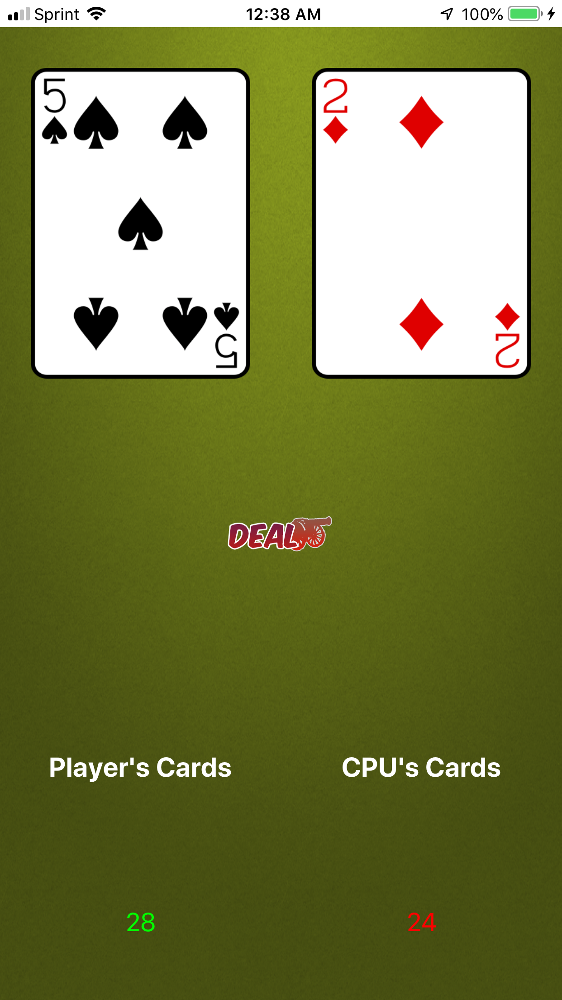
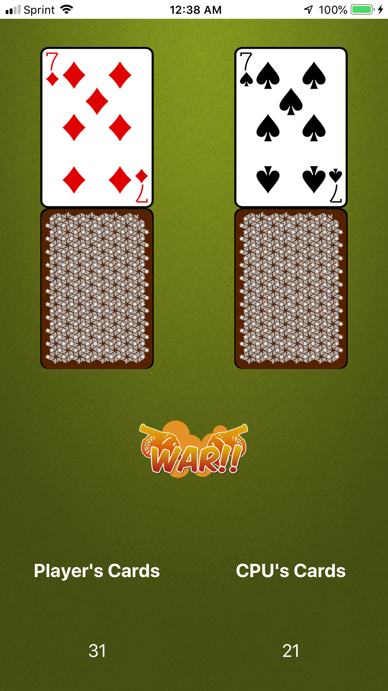
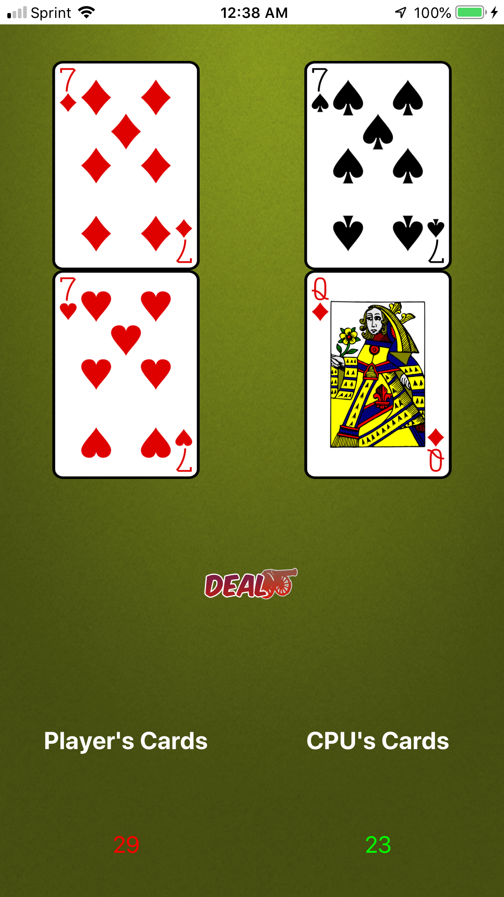
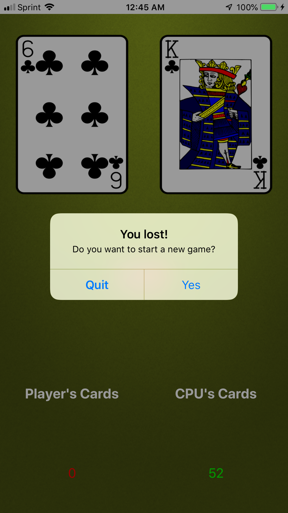

# War
War is an iOS game written in Swift where you can play the classic card game 'War'.

When the game opens, a regular 52 card deck is randomly split between the two players.

Player names default to 'Player' and 'CPU', but can each be changed prior to the game starting.

When the Deal button is pressed, a random card will be drawn from each player's deck, and the player whose card is higher wins both cards.

When the players go to War (they each draw a card of the same value), a second row of cards appears, and the Deal button becomes the War button. The player who wins the War gets all of the cards used in the War.

The game ends when one player gets all 52 cards, at which point you can choose to start a new game or quit.

### Screenshot

### Works on
The app is written in Swift 4, and should run on most devices running iOS 9 or later.
